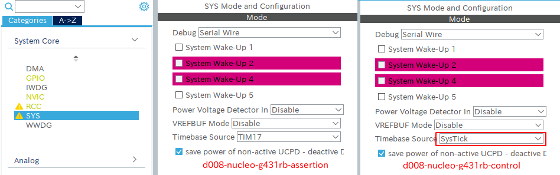

# stm32-defects
A list of the known STM32 HAL defects
<!-- TOC depthto:3 -->

- [stm32-defects](#stm32-defects)
    - [Preface](#preface)
    - [Known Issues](#known-issues)
        - [D002 STM32F7 HAL_EXTI_SetConfigLine runtime bug](#d002-stm32f7-hal_exti_setconfigline-runtime-bug)
        - [D003 STM32G0 HAL_GPIO_EXTI_Callback incompatibility](#d003-stm32g0-hal_gpio_exti_callback-incompatibility)
        - [D004 STM32H7 HAL_I2C_Master_Transmit_IT NAK response is slow](#d004-stm32h7-hal_i2c_master_transmit_it-nak-response-is-slow)
        - [D009 I2C module is excessively generated by CubeIDE](#d009-i2c-module-is-excessively-generated-by-cubeide)
    - [Resolved](#resolved)
        - [D001 Nucleo F722ZE wrong clock configuration](#d001-nucleo-f722ze-wrong-clock-configuration)
        - [D005 STM32L1 HAL_I2C_Master_Sequential_Transmit_IT incompatibility](#d005-stm32l1-hal_i2c_master_sequential_transmit_it-incompatibility)
        - [D006 STM32L1 HAL_EXTI wrong configuration](#d006-stm32l1-hal_exti-wrong-configuration)
        - [D007 STM32H7 cannot use DMA with Duplex I2S mode](#d007-stm32h7-cannot-use-dma-with-duplex-i2s-mode)
        - [D008 CubeIDE generated code failed assertion](#d008-cubeide-generated-code-failed-assertion)
    - [Author](#author)
    - [License](#license)

<!-- /TOC -->
## Preface
These are the correction of the STM32 series CubeIDE/HAL related software bugs. I found them during the development of the [murasaki library](https://github.com/suikan4github/murasaki). So, only murasaki related bugs are listed. 

Pull requests are welcome but please send the one which is relevant to the [murasaki library](https://github.com/suikan4github/stm32-defects). Any other pull requests will be rejected. 

Repository URL : https://github.com/suikan4github/stm32-defects

## Known Issues


### D002 STM32F7 HAL_EXTI_SetConfigLine() runtime bug
| Item                    | Description                |
| ----------------------- | -------------------------- |
| Affected device         | STM32F7                    |
| Last reproduced CubeIDE | -                          | 
| Resolved CubeIDE        | -                          |
| Last reproduced FW      | F7 v1.16.0                 | 
| Resolved FW             | -                          |
| Demo program            | d002-nucleo-f746-exti      |
| Control program         | d002-nucleo-g431rb-control |
| Reported                | [ST Community](https://community.st.com/s/question/0D50X0000CErIa2SQF/stm32f7-halextisetconfigline-configures-exti-incorrectly) , [GitHub](https://github.com/STMicroelectronics/STM32CubeF7/issues/16)              |

#### Description
The HAL_EXTI_SetConfigLine() generates interrupt infinitely, after setting the retrieved configuration data. This is strange behavior. 

#### How to reproduce
 1. Clone this repository
2. Import the project demo program ( see above table ) from git repository to the CubeIDE workspace.
  3. Build and run on NucleoF746ZG

 If the program runs correctly, only the LED2( Blue turn on). But we can see both LED2 and 3 ( Blue and Red) turn on. 

#### Consideration
At the initial state, only LED2( Blue )is turned on. And both LED2 and LED3 ( Blue and Red ) are toggled in the EXTI interrupt call back. Thus, we are watching EXTI13 interrupt is accepted continuously. This is not expected behavior. 

In the main routine, program saves EXTI 13 ( interrupt of the Switch B1 ) interrupt configuration, reset it, and then, re-store the EXTI 13 configuration. This must just enable the edge trigger interrupt. In case of correct implementation, this program toggles LED2 and LED3 only when B1 is pushed. 

```
    HAL_GPIO_WritePin(LD2_GPIO_Port, LD2_Pin, GPIO_PIN_SET);
    HAL_GPIO_WritePin(LD3_GPIO_Port, LD3_Pin, GPIO_PIN_RESET);

    // Get the handle of the EXTI 13 ( B1 switch )
    HAL_EXTI_GetHandle(&hexti_b1, EXTI_LINE_13);

    // Save the configuration of the EXTI 13. This is set as  edge interrupt, by  initializer.
    HAL_EXTI_GetConfigLine(
                           &hexti_b1,
                           &hexti_b1_config
                           );

    // Clear the EXTI 13. Interrupt is disabled.
    HAL_EXTI_ClearConfigLine(&hexti_b1);

    // Restore the EXTI13 configuration. Now, it should be  edge trigger.
    HAL_EXTI_SetConfigLine(&hexti_b1, &hexti_b1_config);

```

#### Control program
The project "d002-nucleo-g431rb-control" shows the expected behavior. This program saves and restores the EXTI 13 as same as the demo project "d002-nucleo-f746-exti" does. While the demo program fails, this control program works as expected. The LED2 toggles only when the switch B1 is pushed. 

Run this program on Nucleo G431RB.

### D003 STM32G0 HAL_GPIO_EXTI_Callback() incompatibility
| Item                    | Description                |
| ----------------------- | -------------------------- |
| Affected device         | STM32G0                    |
| Last reproduced CubeIDE | -                          | 
| Resolved CubeIDE        | -                          |
| Last reproduced FW      | G0 v1.3.0                  | 
| Resolved FW             | -                          |
| Demo program            | d003-nucleo-g070-gpio-exti |
| Control program         | d003-nucleo-g431rb-control |
| Reported                | [ST Community](https://community.st.com/s/question/0D50X0000C6eVvdSQE/stm32g0-hal-exti-callback-implementation-is-buggy)               |

#### Description
The HAL_GPIO_EXTI_Callback() is not called while EXTI interrupt is accepted. 

#### How to reproduce
 1. Clone this repository
2. Import the project demo program ( see above table ) from git repository to the CubeIDE workspace.
  3. Build and run on Nucleo G070

 If the program runs correctly, the green LED brinks for each time the switch B1 is pushed. 

#### Consideration
For the STM32G0, ST changed call back specification as incompatible manner with other series. Thus, the HAL_GPIO_EXTI_Callback() is not called anymore. This is bad way to implement a Hardware "Abstraction" Layer. 

```
void HAL_GPIO_EXTI_Callback(uint16_t GPIO_Pin)
{
    if (GPIO_Pin == GPIO_PIN_13)
    {
        // Toggle LD2 (Green)
        HAL_GPIO_TogglePin(LD2_GPIO_Port, LD2_Pin);
    }
}
```

#### Control program
The project "d003-nucleo-g431rb-control" shows the expected behavior. For each time pushing the swtich B1, the green LED blinks. While the demo program fails, this control program works as expected. The LED2 toggles only when the switch B1 is pushed. 

Run this program on Nucleo G431RB.

### D004 STM32H7 HAL_I2C_Master_Transmit_IT() NAK response is slow
| Item                    | Description                |
| ----------------------- | -------------------------- |
| Affected device         | STM32H7                    |
| Last reproduced CubeIDE | -                          | 
| Resolved CubeIDE        | -                          |
| Last reproduced FW      | H7 v1.7.0                  | 
| Resolved FW             | -                          |
| Demo program            | d004-nucleo-h743-i2c       |
| Control program         | d004-nucleo-g431rb-control |
| Reported                | [ST Community](https://community.st.com/s/question/0D50X0000BoyRlfSQE/bug-report-h743-hali2ctransmitit-respond-incorrectly-when-it-receives-nak)               |

#### Description
According to HAL manner, when I2C NAK is received, the HAL_I2C_ErrorCallback() must be called immediately. But it is called several seconds after NAK received.

#### How to reproduce
 1. Clone this repository
 2. Import the project demo program ( see above table ) from git repository to the CubeIDE workspace.
 3. Build and run on Nucleo H743. Do not mount any I2C device.

 In this hardware setup, there is no I2C device. Thus, any I2C master access cause NAK response
(No response is interpreted as NAK on the I2C bus). If this program run correctly, we will see the red LED turns on by HAL_I2C_ErrorCallback() immediately. But we see the red LED turns on after several second later. This is problem. 

Note that the target I2C device address of the demo program is 1. Connecting any I2C device except address == 1 shows same result. 

#### Consideration
The root cause was too week default configuration of the I2C port by CubeIDE. The configuration of the Max Output Speed is as following : 
| Nucleo   | Max Output Speed |
| -------- | -----------------|
| F722     | Very Hight       |
| H734     | Low              | 

Changing the value from Low to High could solve this problem. This is already reported to ST community. Hopefully, they change the default value. 

#### Control program
The project "d004-nucleo-g431rb-control" shows the expected behavior. Without any IO board, there is no I2C device. You will see the green LED is on immediately by HAL_I2C_ErrorCallback()

Run this program on Nucleo G431RB.


### D009 I2C module is excessively generated by CubeIDE
| Item                    | Description                  |
| ----------------------- | ---------------------------- |
| Affected device         | STM32L1,F0,H7                |
| Last reproduced CubeIDE | v1.3.0                       | 
| Resolved CubeIDE        | -                            |
| Last reproduced FW      | H7 V1.7.0                    | 
| Resolved FW             | -                            |
| Demo program            | d009-nucleo-h743-i2c         |
| Control program         | d009-nucleo-g431rb-control   |
| Reported                | [ST Community](https://community.st.com/s/question/0D53W000002dm7cSAA/i2c-module-is-excessively-generated-by-cubeide)             |

#### Description
The CubeIDE generates the I2C module for HAL, while a user doesn't enable the I2C from the CubeIDE Device Configuration tool. This "excessive" code generation interferes the program which uses HAL_I2C_MODULE_ENABLED by ifdef conditional compilation. 


Same problem exists if you generate a code for Nucleo L152 or F091.

Update 2020/Dec/29 : The problem disappeared L152 by CubeIDE v1.5.0
#### How to reproduce
 1. Create a new Nucleo H743ZI project
 2. Generate the code from the Device Configuration Tool as default condition (All I2C are disabled)
 3. You can find Drivers/STM32H7xx_HAL_Driver/Inc/stm32h7xx_hal_i2c.h while I2C is not chosen in the Device Configuration Tool. 


To demonstrate, follow : 
 1. Clone this repository 
 1. Import the d009-nucleo-h743-i2c
 2. Build it
 3. Run it on the Nucleo H743ZI.

This demonstration project has following code in the main function. While no I2C is configured by the Device Configuration Tool, the program turns on the LED3 (Red). Red LED is the sign of the excessively generated I2C module. 

```
    HAL_GPIO_WritePin(LD3_GPIO_Port, LD3_Pin, GPIO_PIN_RESET);
#ifdef HAL_I2C_MODULE_ENABLED
    // In this project, we don enable I2C by CubeIDE configuration.
    // So, if the following code is executed, project is incorrectly configured.
    HAL_GPIO_WritePin(LD3_GPIO_Port, LD3_Pin, GPIO_PIN_SET);
#endif
```

#### Consideration
Bug of CubeIDE.

#### Control program
The d009-nucleo-g431rb-control has same ifdef block as same as above ( Except it is LED2). The I2C module is not generated. So, the LED doesn't turn on, as excepted. 

Run it on Nucleo G431

## Resolved
### D001 Nucleo F722ZE wrong clock configuration
| Item                    | Description   |
| ----------------------- | ------------- |
| Affected device         | Nucleo F722ZE |
| Last reproduced CubeIDE | 1.3.0         | 
| Resolved CubeIDE        | -             |
| Last reproduced FW      | -             | 
| Resolved FW             | -             |
| Demo program            | -             |
| Control program         | -             |
| Reported                | [ST Community](https://community.st.com/s/question/0D50X0000BfsFICSQ2/bug-report-cubemx-generated-stm32f722-code-gives-broken-character-on-uart-tx)  |
| Confirmed solution      | Cube IDE 1.3.0|

#### Description
In the CubeIDE output project, the default input clock frequency of the Nucleo F722ZE is wrong. It is configured as 25MHz, while it should be 8MHz. 

This problem is disappeared by CubeIDE 1.5.0. The CubeIDE 1.4.5 is not investigated.

#### How to reproduce
Create a new Nucleo F722ZE board project from CubeIDE. By default, the HSE clock frequency is set as 25MHz. 

#### Consideration
This seems to be the problem of the code generator, rather than the embedded firmware. 


### D005 STM32L1 HAL_I2C_Master_Sequential_Transmit_IT() incompatibility
| Item                    | Description                |
| ----------------------- | -------------------------- |
| Affected device         | STM32L1                    |
| Last reproduced CubeIDE | -                          | 
| Resolved CubeIDE        | -                          |
| Last reproduced FW      | L1 v1.9.0                  | 
| Resolved FW             | -                          |
| Demo program            | d005-nucleo-l152-i2c       |
| Control program         | d005-nucleo-g431rb-control |
| Reported                | [ST Community](https://community.st.com/s/question/0D50X0000BbMfEjSQK/stm32l1-hal-has-compatibility-problems-on-i2c-api)               |
| Solution confirmed      | L1 v1.10.2                 |

#### Description
Calling HAL_I2C_Master_Sequential_Transmit_IT() causes build error. 

The build error is disappeared by the firmaware L1 v1.10.2. Other versions are not investigated.

#### How to reproduce
 1. Clone this repository
 2. Import the project demo program ( see above table ) from git repository to the CubeIDE workspace.
 3. Build that project. 

The HAL_I2C_Master_Sequential_Transmit_IT() is on the HAL manual. But causes compile error. 

#### Consideration
This is bug in the HAL. The expected functionality is given by HAL_I2C_Master_Seq_Transmit_IT(). Other STM32 series has compatibility macro to rename from HAL_I2C_Master_Seq_Transmit_IT() to HAL_I2C_Master_Sequential_Transmit_IT(), but ST forgot to provide for STM32L1 series. 

#### Control program
The project "d005-nucleo-g431rb-control" shows the expected behavior. Building this program shows no error. 

### D006 STM32L1 HAL_EXTI wrong configuration
| Item                    | Description                |
| ----------------------- | -------------------------- |
| Affected device         | STM32L1                    |
| Last reproduced CubeIDE | -                          | 
| Resolved CubeIDE        | -                          |
| Last reproduced FW      | L1 v1.9.0                  | 
| Resolved FW             | -                          |
| Demo program            | d006-nucleo-l152-i2c       |
| Control program         | d006-nucleo-g431rb-control |
| Reported                | [ST Community](https://community.st.com/s/question/0D50X0000CCp1QdSQJ/cubeide-doesnt-generate-halexti-for-stm32l152)               |
| Solution confirmed      | L1 v1.10.2                 |

#### Description
Using any resources of EXTI causes compile errors. 

The build error is disappeared by the firmaware L1 v1.10.2. Other versions are not investigated.

#### How to reproduce
 1. Clone this repository
 2. Import the project demo program ( see above table ) from git repository to the CubeIDE workspace.
 3. Build that project. 

The HAL_I2C_Master_Sequential_Transmit_IT() is on the HAL manual. But causes compile error. 

#### Consideration
For any configuration, CubeIDE generates the HAL_EXTI module for all STM32 series. But for the SLT32L1 series, the HAL_EXTI module is not generated. 

#### Control program
The control program ( See above table ) can be compiled without error. 

### D007 STM32H7 cannot use DMA with Duplex I2S mode
| Item                    | Description   |
| ----------------------- | ------------- |
| Affected device         | STM32H        |
| Last reproduced CubeIDE | 1.3.0         | 
| Resolved CubeIDE        | -             |
| Last reproduced FW      | H7 v1.7.0     | 
| Resolved FW             | -             |
| Demo program            | -             |
| Control program         | -             |
| Reported                |               |
| Solution confirmed      | H7 v1.8       |

#### Description
The Duplex I2S mode of the STM32H7 cannot utilize the DMA for both TX and RX in parallel. As a result, DMA transfer is not be able to use in Duplex I2S. 

This problem is disappeared by the firmware H7 v1.8

#### How to reproduce
 1. Create a new Nucleo H743ZI project
 1. Set I2S1 as Duplex Master
 1. Add DMA to I2S1. 

Only 1 DMA can be added. 

#### Consideration
This seems to be an intended limitation. In the ST community, [an employee says they are aware of this limitation](https://community.st.com/s/question/0D50X0000CAtFMtSQN/stm32h7-duplex-i2s-cannot-txrx-simultaneously-through-the-hal). 

Let's stay tuned. 

### D008 CubeIDE generated code failed assertion
| Item                    | Description                  |
| ----------------------- | ---------------------------- |
| Affected device         | STM32G4,F4,H7 ( Could be all)|
| Last reproduced CubeIDE | v1.3.0                       | 
| Resolved CubeIDE        | -                            |
| Last reproduced FW      | G4 v1.2.0                    | 
| Resolved FW             | -                            |
| Demo program            | d008-nucleo-g431rb-assertion |
| Control program         | d008-nucleo-g431rb-control   |
| Reported                | [ST Community](https://community.st.com/s/question/0D50X0000C8cw8HSQQ/assertion-failed-during-the-nivc-initialization)             |
| Solution confirmed      | G4 v1.3.0       |

#### Description
CubeIDE generated code fails assertion. 

This problem is disappeared by the firmware G4 v1.3.0.

#### How to reproduce
 1. Create an Nucleo G431RB project
 2. Enable FreeRTOS v1 interface.
 3. Change Timebase source from SysTick to any other TIM###
 4. Check the "Enable Full Assert" of the Code Generator section of the Project Manager tab on the CubeIDE.
 5. Insert eternal loop into the assert_failure() of the main.c
 6. Run on the Nucleo G431. 

Once run, the assertion failed and CPU loops in the assert_failure() function. 

To demonstrate, follow the procedure. 
 1. Clone this repository
 2. Import the project demo program ( see above table ) from git repository to the CubeIDE workspace.
 3. Build that project. 

#### Consideration
This is because of the confusing parameter passing to the HAL_InitTick(). 

There are two HAL_InitTick(). One is for the system with out FreeRTOS. The other is for the system with FreeRTOS.
 * __weak HAL_StatusTypeDef HAL_InitTick() in stm32g4xx_hal.c : System without FreeRTOS.
 * HAL_StatusTypeDef HAL_InitTick() in stm32g4xx_hal_timebase_tim.c : System with FreeRTOS.
The later one is generated by CubeIDE, while the former is in the HAL firmware. 

The former one records its parameter ( TickPriority ) to the global variable uwTickPrio. The uwTickPrio is passed 
to the HAL_InitTick() when it is called second time, inside SystemClock_Config(). So, second call of the HAL_InitTick()
will not change the priority. 

On the other hand, the other HAL_InitTick() by CubeIDE doesn't record the value to uwTickPrio. Thus, the passed uwTickPrio
inside SystemClock_Config() has default value. This is the reason why the assertion failed. 

#### Control program
The d008-nucleo-g431rb-control is configured as same as d008-nucleo-g431rb-assertion. See figure below. 




## Author
Seiichi Horie

## License
[MIT license](LICENSE)

