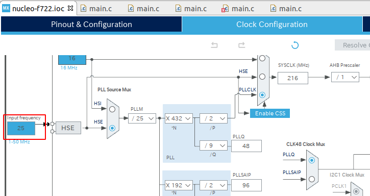

# stm32-defects
A list of the known STM32 HAL defects
<!-- TOC -->

- [stm32-defects](#stm32-defects)
    - [Preface](#preface)
    - [Defects](#defects)
        - [D001 Nucleo F722ZE wrong clock configuration](#d001-nucleo-f722ze-wrong-clock-configuration)
        - [D002 STM32F7 HAL_EXTI_SetConfigLine() runtime bug](#d002-stm32f7-hal_exti_setconfigline-runtime-bug)
        - [D003 STM32G0 HAL_GPIO_EXTI_Callback() incompatibility](#d003-stm32g0-hal_gpio_exti_callback-incompatibility)
        - [D004 STM32H7 HAL_I2C_Master_Transmit_IT() runtime bug](#d004-stm32h7-hal_i2c_master_transmit_it-runtime-bug)
        - [D005 STM32L1 HAL_I2C_Master_Sequential_Transmit_IT() incompatibility](#d005-stm32l1-hal_i2c_master_sequential_transmit_it-incompatibility)
        - [D006 STM32L1 HAL_EXTI wrong configuration](#d006-stm32l1-hal_exti-wrong-configuration)
    - [Resolved](#resolved)
    - [Author](#author)
    - [License](#license)

<!-- /TOC -->
## Preface
Repository URL : https://github.com/suikan4github/stm32-defects

## Defects
This is a collection of the STM32 software bugs which is harmful to the development of the [Murasaki](https://github.com/suikan4github/murasaki) library. 

### D001 Nucleo F722ZE wrong clock configuration
| Item                    | Description   |
| ----------------------- | ------------- |
| Affected device         | Nucleo F722ZE |
| Last reproduced CubeIDE | 1.3.0         | 
| Resolved CubeIDE        | -             |
| Last reproduced FW      | -             | 
| Resolved FW             | -             |
| Sample program          | -             |
| Reported                | ST Community  |

In the CubeIDE output project, the default input clock frequency of the Nucleo F722ZE is wrong. 

It is configured as 25MHz, while it should be 8MHz. 

This seems to be the problem of the code generator, rather than the embedded firmware. 

### D002 STM32F7 HAL_EXTI_SetConfigLine() runtime bug
| Item                    | Description           |
| ----------------------- | --------------------- |
| Affected device         | STM32F7               |
| Last reproduced CubeIDE | -                     | 
| Resolved CubeIDE        | -                     |
| Last reproduced FW      | F7 v1.16.0            | 
| Resolved FW             | -                     |
| Sample program          | d002-nucleo-f746-exti |
| Reported                | ST Community          |

### D003 STM32G0 HAL_GPIO_EXTI_Callback() incompatibility
### D004 STM32H7 HAL_I2C_Master_Transmit_IT() runtime bug
### D005 STM32L1 HAL_I2C_Master_Sequential_Transmit_IT() incompatibility
### D006 STM32L1 HAL_EXTI wrong configuration

## Resolved

## Author
Seiichi Horie

## License
[MIT license](LICENSE)
